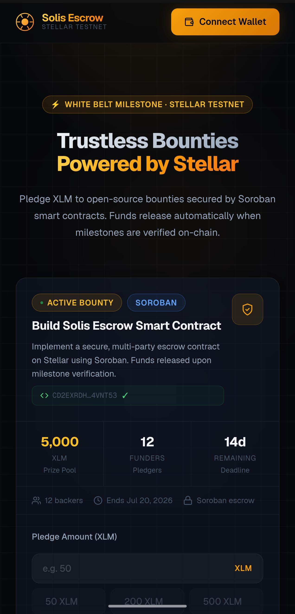
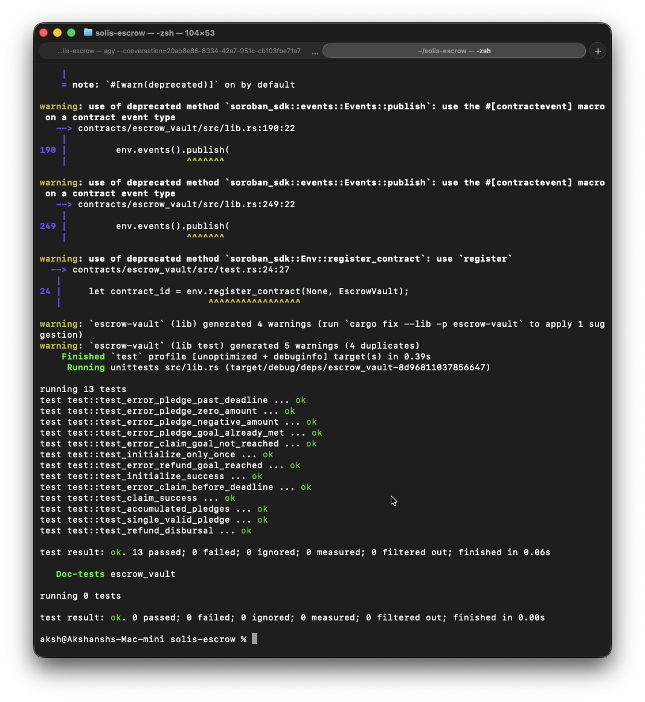
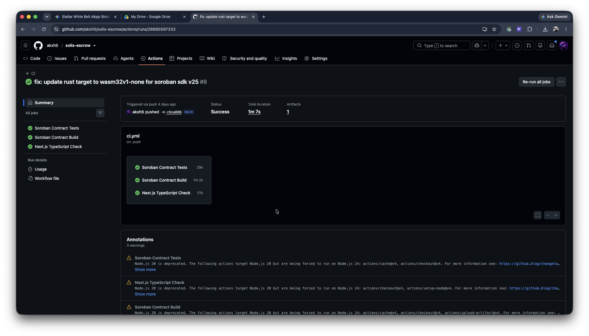

# Solis Escrow

A decentralized crowdfunding and bounty escrow platform built on the **Stellar Network** using **Soroban Smart Contracts**.

Solis Escrow allows open-source projects, backers, and developers to create trustless bounties backed by XLM. Funds pledged by backers are safely held in a Soroban escrow vault smart contract. These funds are only claimable by the admin upon successful completion of the milestones, or fully refundable to the backers if the campaign fails to reach its goal before the deadline.

---

## 🔗 Important Links

* **Live Demo URL:** [https://solis-escrow.vercel.app/](https://solis-escrow.vercel.app/)
* **Demo Video Walkthrough:** [Google Drive Demo Video](https://drive.google.com/file/d/1LQuwgZo4NE4HXsH8mE1zwqwE3S5eLAAo/view?usp=sharing)

---

## 🏛️ Project Architecture & Overview

The project is structured into two core components:

### 1. Soroban Smart Contract (Rust)
Located in `contracts/escrow_vault/`, the contract governs the entire vault lifecycle:
- **`initialize(admin, goal, deadline)`**: Configures the escrow vault parameters. Can only be called once.
- **`pledge(pledger, amount)`**: Allows users to back the bounty with XLM. Validates that the deadline is not passed, amount is valid ($> 0$), and the goal is not yet met.
- **`claim(admin)`**: Allows the designated admin to withdraw the entire prize pool once the goal is met and the deadline is passed.
- **`refund(pledger)`**: Allows backers to safely reclaim their exact XLM pledge if the goal is not met after the deadline passes. Double-refund protections are fully implemented.

### 2. Premium Next.js Frontend (TypeScript & Tailwind)
A high-fidelity client built with Next.js 16 (App Router & Turbopack) featuring:
- **Freighter Wallet Integration**: Connect and disconnect flows with automatic session persistence across refreshes.
- **Real-Time Data**: Active polling from Horizon nodes to maintain up-to-date XLM balances.
- **Non-blocking Transaction UX**: Multi-stage progress tracking (Building → Signing → Submitting → Confirming) with granular on-chain error decoding.
- **High-Fidelity Aesthetics**: Dark-mode glassmorphic styling, rich amber accents, responsive flex-wrap structures, and polished micro-interactions.

---

## 📜 Contract Details (Stellar Testnet)

- **Deployed Contract ID:** `CD2EXRDHSQUZYJZ3MTL25K5LJJI7O7HCVZEZM7IFLUXHJISRB24VNT53`
- **Contract Deploy Transaction Hash:** `1ecbedc34470695a96bfa7e8e43028591302330f8c31e0ec090b115ed1b61252`
- **Contract Initialize Transaction Hash:** `f3afdd415edabc1d1d05f557accca11da2b3326f969dc1d2081a1983af0ee607`

🔗 [View Contract on Stellar Expert Explorer](https://stellar.expert/explorer/testnet/contract/CD2EXRDHSQUZYJZ3MTL25K5LJJI7O7HCVZEZM7IFLUXHJISRB24VNT53)

---

## 📸 Visual Evidence

### Mobile Responsive UI


### 13 Passing Unit Tests


### Green CI/CD Pipeline


---

## 🛠️ Local Development & Setup

### Prerequisites
- Node.js 18+
- [Freighter Wallet](https://freighter.app) browser extension (configured to **Testnet**)
- Rust toolchain (`wasm32v1-none` target + `rust-src` component)
- [Stellar CLI](https://github.com/stellar/stellar-cli) (`v27.0.0`+)

### Setup Commands

1. **Clone and Install dependencies**
   ```bash
   git clone https://github.com/akxh5/solis-escrow.git
   cd solis-escrow
   npm install
   ```

2. **Run Unit Tests**
   ```bash
   cargo test -p escrow-vault --features soroban-sdk/testutils
   ```

3. **Build the WASM Contract**
   ```bash
   stellar contract build
   ```

4. **Run the Next.js Client**
   ```bash
   npm run dev
   ```
   Open [http://localhost:3000](http://localhost:3000) to view the application.

---

*Built with ❤️ for the Level 3 (Orange Belt) submission.*
