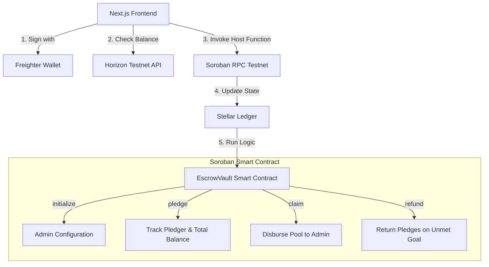
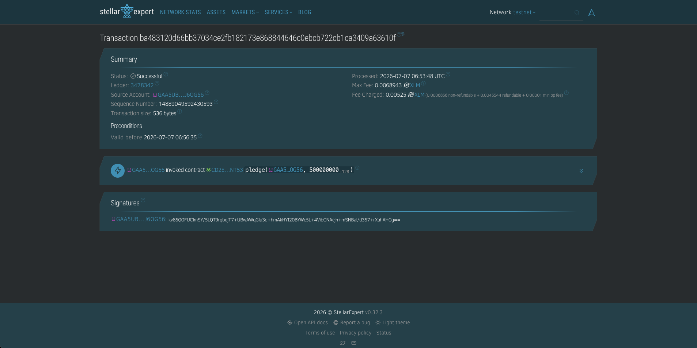
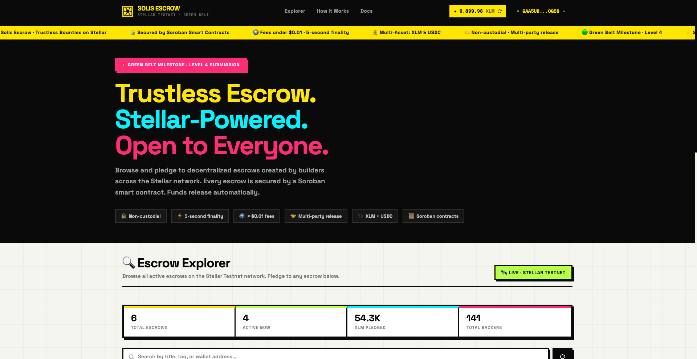

# Solis Escrow

A decentralized crowdfunding and bounty escrow platform built on the **Stellar Network** using **Soroban Smart Contracts**.

Solis Escrow allows open-source projects, backers, and developers to create trustless bounties backed by XLM. Funds pledged by backers are safely held in a Soroban escrow vault smart contract. These funds are only claimable by the admin upon successful completion of the milestones, or fully refundable to the backers if the campaign fails to reach its goal before the deadline.

---

## 🔗 Important Links

* **Live Demo URL:** [https://solis-escrow.vercel.app/](https://solis-escrow.vercel.app/)
* **Demo Video Walkthrough:** [Google Drive Demo Video](https://drive.google.com/file/d/1LQuwgZo4NE4HXsH8mE1zwqwE3S5eLAAo/view?usp=sharing)

---

## 🏛️ System Architecture

Solis Escrow relies on a trustless Web3 architectural flow integrating the Stellar network ecosystem, Freighter wallet interface, and a custom Soroban Rust contract.



### Flow Breakdown
1. **Wallet Authentication & Sessions:** The Next.js frontend uses `@creit.tech/stellar-wallets-kit` to request public keys from the Freighter extension. Session states are persisted securely across page refreshes.
2. **Horizon Balance Monitoring:** Pledger XLM balances are monitored in real-time by querying Horizon API nodes.
3. **RPC Simulation & Assembly:** Before submitting a transaction, it is simulated on the Soroban RPC. Resource fees and authorization parameters are automatically adjusted.
4. **Soroban Escrow State Machine:** The Rust-based contract handles the pool logic:
   - **Under Goal / Before Deadline:** Pledgers can back the bounty. Claims and refunds are locked.
   - **Goal Met / After Deadline:** The designated administrator is authorized to execute the `claim` method to withdraw the balance.
   - **Goal Unmet / After Deadline:** Individual backers can trigger the `refund` method to reclaim their contributions, protected by zero-out and double-refund guards.

---

## 📜 Smart Contract Verification (Stellar Testnet)

- **Deployed Contract ID:** `CD2EXRDHSQUZYJZ3MTL25K5LJJI7O7HCVZEZM7IFLUXHJISRB24VNT53`
- **Contract Deploy Transaction Hash:** `1ecbedc34470695a96bfa7e8e43028591302330f8c31e0ec090b115ed1b61252`
- **Contract Initialize Transaction Hash:** `f3afdd415edabc1d1d05f557accca11da2b3326f969dc1d2081a1983af0ee607`

🔗 [View Contract on Stellar Expert Explorer](https://stellar.expert/explorer/testnet/contract/CD2EXRDHSQUZYJZ3MTL25K5LJJI7O7HCVZEZM7IFLUXHJISRB24VNT53)

### Testnet Transaction


---

## 💻 Frontend & Mobile UI

### Desktop Interface


### Mobile Responsive UI


---

## ⚙️ CI/CD & Testing (DevOps)

### 13 Passing Unit Tests


### Green CI/CD Pipeline


---

## 🛠️ Local Development & Setup

### Prerequisites
- Node.js 18+
- [Freighter Wallet](https://freighter.app) browser extension (configured to **Testnet**)
- Rust toolchain (`wasm32v1-none` target + `rust-src` component)
- [Stellar CLI](https://github.com/stellar/stellar-cli) (`v27.0.0`+)

### Setup Commands

1. **Clone and Install dependencies**
   ```bash
   git clone https://github.com/akxh5/solis-escrow.git
   cd solis-escrow
   npm install
   ```

2. **Run Unit Tests**
   ```bash
   cargo test -p escrow-vault --features soroban-sdk/testutils
   ```

3. **Build the WASM Contract**
   ```bash
   stellar contract build
   ```

4. **Run the Next.js Client**
   ```bash
   npm run dev
   ```
   Open [http://localhost:3000](http://localhost:3000) to view the application.

---

*Built with ❤️ for the Level 3 (Orange Belt) submission.*
