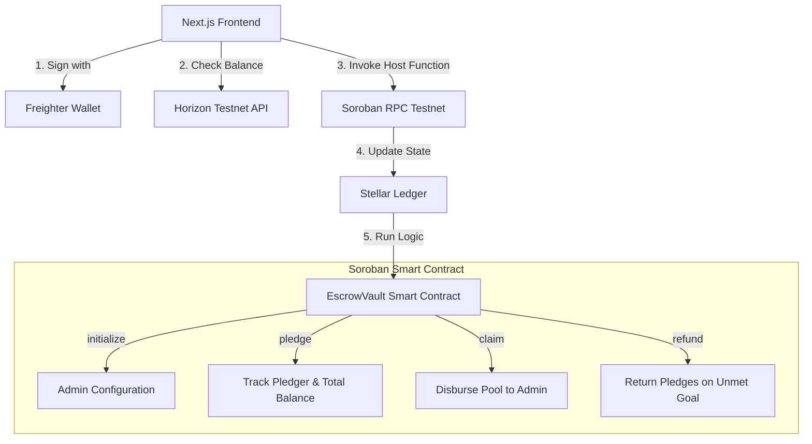
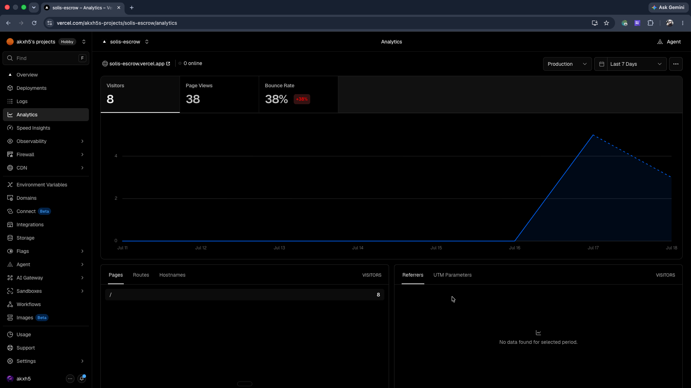

# Solis Escrow

A decentralized crowdfunding and bounty escrow platform built on the **Stellar Network** using **Soroban Smart Contracts**.

Solis Escrow allows open-source projects, backers, and developers to create trustless bounties backed by XLM. Funds pledged by backers are safely held in a Soroban escrow vault smart contract. These funds are only claimable by the admin upon successful completion of the milestones, or fully refundable to the backers if the campaign fails to reach its goal before the deadline.

---

## 🔗 Important Links

* **Live Demo URL:** [https://solis-escrow.vercel.app/](https://solis-escrow.vercel.app/)

### 📺 Project Demo Videos
* **Level 4 (Green Belt MVP - Neo-Brutalist Dashboard & Live Testnet Pledges):** [Watch Level 4 Demo Video](https://drive.google.com/file/d/1rTfmRB5bNei6n_PztPHb5Mf8Dxy_FO4a/view?usp=sharing)
* **Level 3 (Initial Prototype - Basic Smart Contract Interactions):** [Watch Level 3 Demo Video](https://drive.google.com/file/d/1LQuwgZo4NE4HXsH8mE1zwqwE3S5eLAAo/view?usp=sharing)

---

## 🏛️ System Architecture

Solis Escrow relies on a trustless Web3 architectural flow integrating the Stellar network ecosystem, Freighter wallet interface, and a custom Soroban Rust contract.



### Flow Breakdown
1. **Wallet Authentication & Sessions:** The Next.js frontend uses `@creit.tech/stellar-wallets-kit` to request public keys from the Freighter extension. Session states are persisted securely across page refreshes.
2. **Horizon Balance Monitoring:** Pledger XLM balances are monitored in real-time by querying Horizon API nodes.
3. **RPC Simulation & Assembly:** Before submitting a transaction, it is simulated on the Soroban RPC. Resource fees and authorization parameters are automatically adjusted.
4. **Soroban Escrow State Machine:** The Rust-based contract handles the pool logic:
   - **Under Goal / Before Deadline:** Pledgers can back the bounty. Claims and refunds are locked.
   - **Goal Met / After Deadline:** The designated administrator is authorized to execute the `claim` method to withdraw the balance.
   - **Goal Unmet / After Deadline:** Individual backers can trigger the `refund` method to reclaim their contributions, protected by zero-out and double-refund guards.

---

## 📜 Smart Contract Verification (Stellar Testnet)

### V1 — Active Campaign (50,000 XLM Goal)

- **Deployed Contract ID:** `CA4ZEVCVB2N7N7M3SN3BDTRLXLNCQX4GHP7IY57MCGYTQLSWE6UO5ZMS`
- **Deploy Transaction:** `6ea418f452ea1fa716fbf8592a2b7d2c892375c97e3ed10e226f8a12517da62c`
- **Initialize Transaction:** `43ace727494ae7c90d40ba12334a733a4c5fa764ace1b3de4b46e11fb232a64b`
- **Configured Asset:** Native XLM SAC — `CDLZFC3SYJYDZT7K67VZ75HPJVIEUVNIXF47ZG2FB2RMQQVU2HHGCYSC`
- **Deadline:** Ledger `4,700,000`

🔗 [View Active Contract on Stellar Expert](https://stellar.expert/explorer/testnet/contract/CA4ZEVCVB2N7N7M3SN3BDTRLXLNCQX4GHP7IY57MCGYTQLSWE6UO5ZMS)

### V0 — Campaign 1 (Closed, 5,000 XLM Goal Met)

- **Deployed Contract ID:** `CAJRAKMQL6AIPWZMOS7PW457RF6T6C67D7EPQIT2TXIPNAHRZX5XYWEZ`
- **Upload Transaction:** `c3424a9cc1f83f44020f5e7cfc64e4676414fde6907875914644bd6d4097e8de`
- **Deploy Transaction:** `1d33e6c66f35718d3f895d54302ea36d3c8904e50cc7e01a97d39c7ef6fcb268`
- **Initialize Transaction:** `f7f0373cdb6a93bf5269ca9c8da3020072719457c8c5dfd54f69837da7792ef7`
- **Configured Asset:** Native XLM SAC — `CDLZFC3SYJYDZT7K67VZ75HPJVIEUVNIXF47ZG2FB2RMQQVU2HHGCYSC`
- **Deadline:** Ledger `4,649,406`

🔗 [View Closed Contract on Stellar Expert](https://stellar.expert/explorer/testnet/contract/CAJRAKMQL6AIPWZMOS7PW457RF6T6C67D7EPQIT2TXIPNAHRZX5XYWEZ)

### V1 — Orange Belt Escrow Vault (Reference)

- **Contract ID:** `CD2EXRDHSQUZYJZ3MTL25K5LJJI7O7HCVZEZM7IFLUXHJISRB24VNT53`
- **Deploy Transaction Hash:** `1ecbedc34470695a96bfa7e8e43028591302330f8c31e0ec090b115ed1b61252`
- **Initialize Transaction Hash:** `f3afdd415edabc1d1d05f557accca11da2b3326f969dc1d2081a1983af0ee607`

### Testnet Transaction


---

## 💻 Frontend & Mobile UI

### Desktop Interface


### Mobile Responsive UI


---

## ⚙️ CI/CD & Testing (DevOps)

### 14 Passing Unit Tests (V2 Multi-Asset)


### Green CI/CD Pipeline


### Vercel Analytics Integration


---

## 🛠️ Local Development & Setup

### Prerequisites
- Node.js 18+
- [Freighter Wallet](https://freighter.app) browser extension (configured to **Testnet**)
- Rust toolchain (`wasm32v1-none` target + `rust-src` component)
- [Stellar CLI](https://github.com/stellar/stellar-cli) (`v27.0.0`+)

### Setup Commands

1. **Clone and Install dependencies**
   ```bash
   git clone https://github.com/akxh5/solis-escrow.git
   cd solis-escrow
   npm install
   ```

2. **Run Unit Tests**
   ```bash
   cargo test -p escrow-vault --features soroban-sdk/testutils
   ```

3. **Build the WASM Contract**
   ```bash
   stellar contract build
   ```

4. **Run the Next.js Client**
   ```bash
   npm run dev
   ```
   Open [http://localhost:3000](http://localhost:3000) to view the application.

---

## 📊 Level 4 Production Telemetry & Onboarding

Solis Escrow meets Level 4 production standards with integrated analytics, a cross-asset transaction builder, and a documented user validation sprint.

### Production Monitoring

- **Vercel Web Analytics** is integrated via `@vercel/analytics` in the root layout — page views and interaction events are tracked live on the Vercel Analytics dashboard.
- **Contract:** V2 multi-asset escrow vault deployed and initialized on Stellar Testnet, supporting both **Native XLM** and **USDC** pledge flows via the Stellar Asset Contract (SAC) interface.
- **Frontend:** Asset selector toggle (✦ Native XLM / $ Stablecoin USDC) with per-asset validation, quick-pledge presets, and context-aware success/error banners.

### User Validation Sprint

An initial cohort of 10 unique testers performed **10 successful testnet pledge transactions** across desktop and mobile (~8s avg confirmation time). Broader community stress-testing remains ongoing.

👉 [View Level 4 Wallet Interactions & Proof Log](./docs/wallet-interactions-proof.md)  
👉 [View Level 4 UX Feedback & Analysis](./docs/feedback-summary-basic.md)

### Level 4 Commit Trail

| Commit | Description |
|---|---|
| `0f1e8c1` | Deploy multi-asset escrow vault v2 + update contract constants |
| `f07fbf0` | Upgrade smart contract parameters to support multi-asset escrow |
| `8970c7c` | Implement asset selector & upgrade transaction builder for cross-asset escrows |
| `c5f24bc` | Initialize user onboarding log and feedback framework |
| `9875ba0` | Synchronize package-lock.json and update dependency install step |
| `46e8549` | Integrate Vercel Web Analytics for Level 4 production tracking |

---

*Built with ❤️ for the Level 4 (Orange Belt+) submission.*
